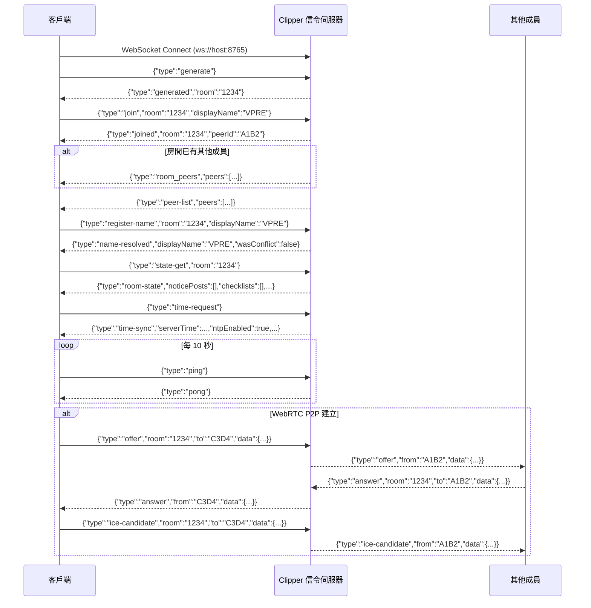
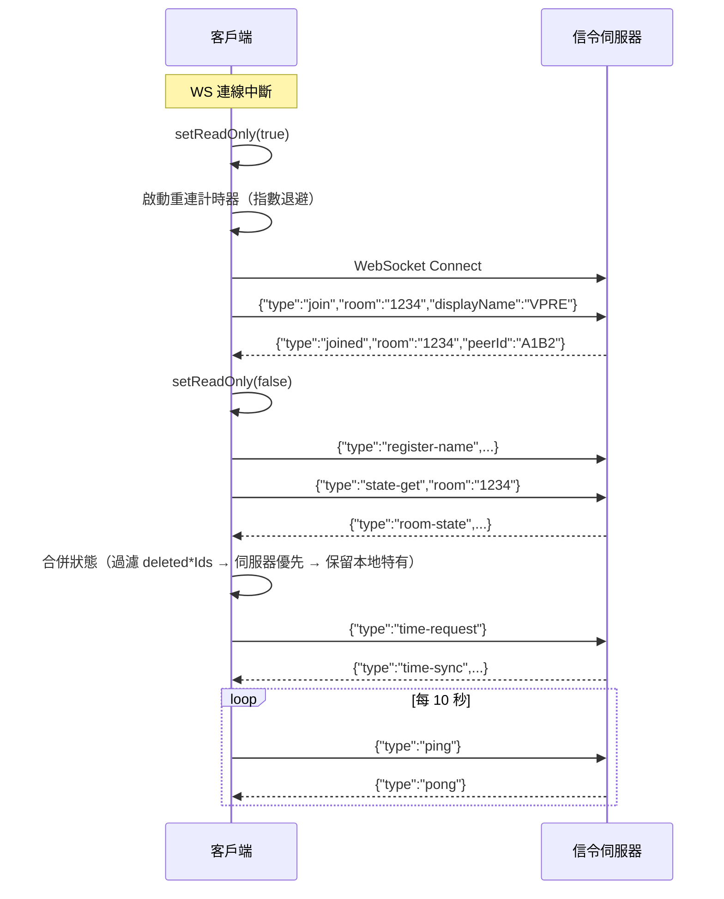

# Clipper WebSocket 協定文件

> **版本**：2.2.0  
> **通訊埠**：WebSocket 8765 · HTTP 8766  
> **傳輸**：JSON text frames  
> **房間模式**：4 位數字配對碼  
> **連線方式**：`ws://localhost:8765`  
> **支援插件**: Client 插件 (`ClipperPlugins.register`) + Server 插件 (`@register` decorator)

---

## 目錄

1. [連線流程](#1-連線流程)
2. [訊息類型總覽](#2-訊息類型總覽)
3. [訊息類型詳細說明](#3-訊息類型詳細說明)
   - [3.1 房間與連線](#31-房間與連線)
   - [3.2 心跳](#32-心跳)
   - [3.3 名稱註冊](#33-名稱註冊)
   - [3.4 WebRTC 信令](#34-webrtc-信令)
   - [3.5 房間狀態同步](#35-房間狀態同步)
   - [3.6 時間同步](#36-時間同步)
   - [3.7 聊天](#37-聊天)
   - [3.8 公告欄 CRUD](#38-公告欄-crud)
   - [3.9 檢查清單 Board CRUD](#39-檢查清單-board-crud)
   - [3.10 檢查清單項目](#310-檢查清單項目)
   - [3.11 密鑰管理](#311-密鑰管理)
   - [3.12 WS 中繼傳輸](#312-ws-中繼傳輸)
   - [3.13 成員管理](#313-成員管理)
   - [3.14 管理員功能](#314-管理員功能)
   - [3.15 診斷](#315-診斷)
4. [房間狀態合併演算法](#4-房間狀態合併演算法)
5. [離線唯讀保護機制](#5-離線唯讀保護機制)
6. [重連與狀態同步流程](#6-重連與狀態同步流程)
7. [錯誤碼對照表](#7-錯誤碼對照表)

---

## 1. 連線流程



---

## 2. 訊息類型總覽

| 分類 | 方向 | 類型 |
|------|------|------|
| **房間與連線** | Client→Server | `generate`, `join` |
| | Server→Client | `generated`, `joined`, `room_full`, `error` |
| **心跳** | 雙向 | `ping` / `pong` |
| **名稱註冊** | Client→Server | `register-name` |
| | Server→Client | `name-resolved` |
| **WebRTC 信令** | 雙向 | `offer`, `answer`, `ice-candidate` |
| **房間狀態** | Client→Server | `state-get`, `dump` |
| | Server→Client | `room-state`, `dump-result` |
| **時間同步** | Client→Server | `time-request`, `ntp-config` |
| | Server→Client | `time-sync`, `ntp-config-result` |
| **聊天** | Client→Server | `chat-backup`, `chat-history` |
| | Server→Client | `chat-history-result` |
| **公告欄** | 雙向 | `notice-create`, `notice-edit`, `notice-delete`, `notice-pin` |
| **檢查清單 Board** | 雙向 | `checklistboard-create`, `checklistboard-edit`, `checklistboard-delete`, `checklistboard-pin`, `checklistboard-remind` |
| **檢查清單項目** | 雙向 | `checklist-add`, `checklist-toggle`, `checklist-delete`, `checklist-reset`, `checklist-reorder` |
| **插件系統** | 動態 | Client: `ClipperPlugins.register(desc)` · Server: `@register("plugin-*")` |
| **密鑰管理** | 雙向 | `keymgmt-create`, `keymgmt-edit`, `keymgmt-delete`, `keymgmt-toggle-active`, `keymgmt-set-program` |
| **WS 中繼** | 雙向 | `relay-data`, `relay-chunk`, `file-cancel` |
| **成員管理** | Server→Client | `room_peers`, `peer_joined`, `peer_left`, `peer-list` |
| **管理員** | 雙向 | `admin-login` → `admin-login-result` |
| | | `admin-logs` → `admin-logs-result` |
| | | `admin-log-download` → `admin-log-download-result` |
| | | `admin-change-password` → `admin-change-password-result` |
| | | `admin-get-config` → `admin-config` |
| | | `admin-set-config` → `admin-set-config-result` |
| | | `admin-export` → `admin-export-result` |
| | | `admin-import` → `admin-import-result` |

---

## 3. 訊息類型詳細說明

### 3.1 房間與連線

---

#### `generate` / `generated`

產生一個新的 4 位數字配對碼房間。

- **方向**：Client→Server → Server→Client
- **說明**：客戶端請求伺服器建立一個新房間，伺服器分配一個 1000–9999 的配對碼。

**Request**：
```json
{
  "type": "generate"
}
```

**Response** (`generated`)：
```json
{
  "type": "generated",
  "room": "5832"
}
```

- **注意事項**：收到 `generated` 後客戶端應立即發送 `join` 並帶上相同的 `room` 值。

---

#### `join` / `joined`

加入一個房間。

- **方向**：Client→Server → Server→Client
- **說明**：使用 4 位配對碼加入房間。分配一個 4 字元大寫英數字元 peer ID。

**Request**：
```json
{
  "type": "join",
  "room": "1234",
  "displayName": "VPRE"
}
```

**Response** (`joined`)：
```json
{
  "type": "joined",
  "room": "1234",
  "peerId": "A1B2"
}
```

- **請求欄位**：
  - `room`（必填）：4 位數字配對碼
  - `displayName`（選填）：顯示名稱，預設為 peerId
- **注意事項**：
  - 若房間已達 50 人上限，伺服器回傳 `room_full`
  - 若已在其他房間，會自動離開前一個房間
  - 成功加入後客戶端應發送 `register-name`、`state-get`、`time-request`
  - 客戶端應啟動 10 秒間隔的 `ping` 心跳

---

#### `room_full`

房間人數已達上限。

- **方向**：Server→Client
- **說明**：當房間已滿 50 人時回覆加入請求。

**Response**：
```json
{
  "type": "room_full",
  "room": "1234"
}
```

- **注意事項**：客戶端應提示用戶房間已滿，不可再發送 join。

---

#### `error`

通用錯誤訊息。

- **方向**：Server→Client
- **說明**：各種錯誤情況的通用回覆。

**Response**：
```json
{
  "type": "error",
  "message": "room is required"
}
```

- **已知錯誤訊息**：
  | 訊息 | 說明 |
  |------|------|
  | `room is required` | 缺少 room 欄位 |
  | `room not found` | 指定的房間不存在 |
  | `target peer 'XXX' not found in room` | WebRTC 信令目標不存在 |
  | `relay target not found` | WS 中繼目標不存在 |
  | `unauthorized` | 管理員會話過期 |
  | `invalid register-name` | 名稱註冊參數不完整 |
  | `checklistId required` | 缺少 checklistId 欄位 |

---

### 3.2 心跳

#### `ping` / `pong`

維持連線的心跳機制。

- **方向**：雙向
- **說明**：客戶端每 10 秒發送 `ping`，伺服器回覆 `pong`。伺服器也會在背景每 10 秒檢查心跳逾時（20 秒無回應視為斷線）。

**Request**：
```json
{
  "type": "ping"
}
```

**Response**：
```json
{
  "type": "pong"
}
```

- **注意事項**：伺服器在 `handler` 中處理 `ping` 時會更新 `lastHeartbeat` 時間戳。逾時 20 秒的 peer 會被自動踢除。

---

### 3.3 名稱註冊

#### `register-name` / `name-resolved`

註冊顯示名稱（伺服器處理重複衝突）。

- **方向**：Client→Server → Server→Client
- **說明**：加入房間後客戶端應發送此訊息註冊顯示名稱。伺服器會檢查名稱衝突，若已存在則自動加上 `_N` 後綴。

**Request**：
```json
{
  "type": "register-name",
  "room": "1234",
  "displayName": "VPRE"
}
```

**Response** (`name-resolved`)：
```json
{
  "type": "name-resolved",
  "displayName": "VPRE",
  "wasConflict": false
}
```

- **衝突範例**：
  ```json
  {
    "type": "name-resolved",
    "displayName": "VPRE_2",
    "wasConflict": true
  }
  ```
- **注意事項**：伺服器會將最終名稱更新到房間 peer 資訊中，並廣播 `peer-list` 給所有客戶端。

---

### 3.4 WebRTC 信令

#### `offer`

WebRTC SDP Offer。

- **方向**：Peer→Server→Peer（雙向）
- **說明**：透過信令伺服器轉發 WebRTC SDP Offer 給目標 peer。

**Request**：
```json
{
  "type": "offer",
  "room": "1234",
  "to": "C3D4",
  "data": {
    "type": "offer",
    "sdp": "v=0\r\no=...\r\n..."
  }
}
```

**Response**（轉發給目標 peer）：
```json
{
  "type": "offer",
  "from": "A1B2",
  "data": {
    "type": "offer",
    "sdp": "v=0\r\no=...\r\n..."
  }
}
```

- **注意事項**：若 `to` 欄位省略且房間只有 2 人，自動轉發給另一人（向上相容）。若 `to` 指定的 peer 不存在，回覆 `error`。

---

#### `answer`

WebRTC SDP Answer。

- **方向**：Peer→Server→Peer（雙向）
- **說明**：回覆 WebRTC SDP Answer 給發起方。

**Request**：
```json
{
  "type": "answer",
  "room": "1234",
  "to": "A1B2",
  "data": {
    "type": "answer",
    "sdp": "v=0\r\no=...\r\n..."
  }
}
```

**Response**（轉發給目標 peer）：
```json
{
  "type": "answer",
  "from": "C3D4",
  "data": {
    "type": "answer",
    "sdp": "v=0\r\no=...\r\n..."
  }
}
```

---

#### `ice-candidate`

WebRTC ICE Candidate。

- **方向**：Peer→Server→Peer（雙向）
- **說明**：逐個轉發 ICE Candidate 給目標 peer，實現 Trickle ICE。

**Request**：
```json
{
  "type": "ice-candidate",
  "room": "1234",
  "to": "A1B2",
  "data": {
    "candidate": "candidate:1 1 UDP 2122252543 192.168.1.100 54321 typ host",
    "sdpMid": "0",
    "sdpMLineIndex": 0
  }
}
```

**Response**（轉發給目標 peer）：
```json
{
  "type": "ice-candidate",
  "from": "C3D4",
  "data": {
    "candidate": "candidate:1 1 UDP 2122252543 192.168.1.100 54321 typ host",
    "sdpMid": "0",
    "sdpMLineIndex": 0
  }
}
```

- **注意事項**：客戶端應使用 `event.candidate.toJSON()` 序列化 ICE candidate。

---

### 3.5 房間狀態同步

#### `state-get` / `room-state`

請求伺服器持久化的房間狀態。

- **方向**：Client→Server → Server→Client
- **說明**：客戶端加入房間後請求完整狀態，包含公告欄、檢查清單、密鑰管理等資料。

**Request**：
```json
{
  "type": "state-get",
  "room": "1234"
}
```

**Response** (`room-state`)：
```json
{
  "type": "room-state",
  "noticePosts": [
    {
      "id": "uuid",
      "title": "公告標題",
      "content": "公告內容",
      "author": "VPRE",
      "category": "重要",
      "tags": ["廣播", "緊急"],
      "color": "#ef4444",
      "pinned": false,
      "timestamp": 1700000000000
    }
  ],
  "checklists": [
    {
      "id": "uuid",
      "title": "檢查表",
      "category": "每日檢查",
      "tags": ["設備"],
      "color": "#38bdf8",
      "pinned": false,
      "items": [
        {
          "id": "uuid",
          "text": "檢查攝影機",
          "checked": false,
          "checkedAt": null
        }
      ]
    }
  ],
  "keyManagements": [
    {
      "id": "uuid",
      "label": "主頻道",
      "streamKey": "...",
      "streamUrl": "rtmp://...",
      "currentProgram": "晚間新聞",
      "isActive": true,
      "updatedAt": 1700000000000
    }
  ],
  "deletedPostIds": ["deleted-uuid-1"],
  "deletedChecklistIds": ["deleted-uuid-2"],
  "deletedKeyIds": ["deleted-uuid-3"]
}
```

- **注意事項**：
  - 客戶端應先過濾 `deleted*Ids` 再合併狀態（防幽靈復活）
  - 客戶端合併策略：伺服器資料優先，保留本地特有的項目

---

#### `dump` / `dump-result`

診斷用：輸出伺服器完整狀態。

- **方向**：Client→Server → Server→Client
- **說明**：在關於頁面點擊「Debug Dump」按鈕觸發，回傳所有房間的資料摘要。

**Request**：
```json
{
  "type": "dump"
}
```

**Response** (`dump-result`)：
```json
{
  "type": "dump-result",
  "timestamp": "2026-01-01T12:00:00+00:00",
  "retention_days": 7,
  "room_count": 3,
  "rooms": {
    "1234": {
      "peerCount": 2,
      "noticePosts": [...],
      "checklists": [...],
      "chatMessageCount": 15
    }
  }
}
```

---

### 3.6 時間同步

#### `time-request` / `time-sync`

客戶端請求伺服器當前時間。

- **方向**：Client→Server → Server→Client
- **說明**：客戶端用於計算時間偏移量（NTP 補償）。伺服器回覆包含 NTP 狀態。

**Request**：
```json
{
  "type": "time-request"
}
```

**Response** (`time-sync`)：
```json
{
  "type": "time-sync",
  "serverTime": 1700000000000.0,
  "ntpEnabled": true,
  "ntpServer": "stdtime.gov.hk",
  "ntpValid": true
}
```

- **客戶端計算**：
  ```javascript
  const offset = data.serverTime - Date.now();
  // 僅在偏移量 < 24h 時採用
  if (Math.abs(offset) < 86400000) {
      timeSource = 'server';
  }
  ```

---

#### `ntp-config` / `ntp-config-result`

管理員設定 NTP 伺服器。

- **方向**：Client→Server → Server→Client
- **說明**：僅限管理員（需 token），設定 NTP 伺服器位址與啟用狀態。

**Request**：
```json
{
  "type": "ntp-config",
  "token": "session-token",
  "ntpServer": "stdtime.gov.hk",
  "ntpEnabled": true
}
```

**Response** (`ntp-config-result`)：
```json
{
  "type": "ntp-config-result",
  "ntpServer": "stdtime.gov.hk",
  "ntpEnabled": true,
  "ntpOffset": 0.032,
  "ntpValid": true
}
```

- **注意事項**：
  - 需要有效的管理員 token（否則回覆 `error: unauthorized`）
  - 啟用 NTP 時伺服器會立即查詢一次，`ntpOffset` 為查詢結果
  - `ntpValid` 為 `false` 表示 NTP 伺服器無回應

---

### 3.7 聊天

#### `chat-backup`

將聊天訊息備份到伺服器。

- **方向**：Client→Server
- **說明**：客戶端透過任意通道（P2P 或 Relay）收到聊天訊息後，應發送此訊息備份到伺服器。伺服器會強制保留天數（預設 7 天）。

**Request**：
```json
{
  "type": "chat-backup",
  "room": "1234",
  "text": "大家好！",
  "from": "VPRE",
  "timestamp": 1700000000000
}
```

- **注意事項**：
  - 無對應的 Server→Client 回覆（僅伺服器儲存）
  - 伺服器會加上 `serverReceivedAt` 時間戳
  - 超過保留天數的舊訊息自動剔除

---

#### `chat-history` / `chat-history-result`

請求聊天歷史。

- **方向**：Client→Server → Server→Client
- **說明**：客戶端請求聊天歷史紀錄，可選用 `since` 參數指定時間門檻。

**Request**：
```json
{
  "type": "chat-history",
  "room": "1234",
  "since": 1700000000000
}
```

**Response** (`chat-history-result`)：
```json
{
  "type": "chat-history-result",
  "messages": [
    {
      "text": "大家好！",
      "from": "VPRE",
      "timestamp": 1700000000000,
      "serverReceivedAt": 1700000001000
    }
  ],
  "room": "1234"
}
```

- **注意事項**：
  - 若不提供 `since`，使用保留天數作為過濾門檻
  - `serverReceivedAt` 為伺服器收到備份的時間戳

---

### 3.8 公告欄 CRUD

#### `notice-create`

建立公告。

- **方向**：雙向（發送端→伺服器→所有成員）
- **說明**：客戶端請求建立公告，伺服器儲存並廣播給房間所有成員。

**Request**（Client→Server）：
```json
{
  "type": "notice-create",
  "room": "1234",
  "post": {
    "id": "uuid",
    "title": "緊急通知",
    "content": "今天下午進行系統維護",
    "author": "VPRE",
    "category": "重要",
    "tags": ["系統", "維護"],
    "color": "#ef4444",
    "pinned": false,
    "timestamp": 1700000000000
  }
}
```

**Broadcast**（Server→所有成員，含發起者以外的人）：
```json
{
  "type": "notice-create",
  "post": {
    "id": "uuid",
    "title": "緊急通知",
    "content": "今天下午進行系統維護",
    "author": "VPRE",
    "category": "重要",
    "tags": ["系統", "維護"],
    "color": "#ef4444",
    "pinned": false,
    "timestamp": 1700000000000
  }
}
```

---

#### `notice-edit`

編輯公告。

- **方向**：雙向
- **說明**：編輯現有公告的標題、內容、分類、標籤、顏色。

**Request**：
```json
{
  "type": "notice-edit",
  "room": "1234",
  "id": "post-uuid",
  "title": "更新標題",
  "content": "更新內容",
  "category": "日常",
  "tags": ["廣播"],
  "color": "#38bdf8",
  "editedAt": 1700000000000
}
```

**Broadcast**：
```json
{
  "type": "notice-edit",
  "id": "post-uuid",
  "title": "更新標題",
  "content": "更新內容",
  "category": "日常",
  "tags": ["廣播"],
  "color": "#38bdf8",
  "editedAt": 1700000000000
}
```

- **注意事項**：支援部分更新 — 只傳需要修改的欄位即可。

---

#### `notice-delete`

刪除公告。

- **方向**：雙向
- **說明**：刪除公告並記錄到 `deletedPostIds` 防止幽靈復活。

**Request**：
```json
{
  "type": "notice-delete",
  "room": "1234",
  "id": "post-uuid"
}
```

**Broadcast**：
```json
{
  "type": "notice-delete",
  "id": "post-uuid"
}
```

---

#### `notice-pin`

釘選/取消釘選公告。

- **方向**：雙向
- **說明**：切換公告的置頂狀態。

**Request**：
```json
{
  "type": "notice-pin",
  "room": "1234",
  "id": "post-uuid",
  "pinned": true
}
```

**Broadcast**：
```json
{
  "type": "notice-pin",
  "id": "post-uuid",
  "pinned": true
}
```

---

### 3.9 檢查清單 Board CRUD

#### `checklistboard-create`

建立檢查清單 Board。

- **方向**：雙向
- **說明**：建立一個新的檢查清單 Board（包含標題、分類、標籤、顏色、項目）。

**Request**：
```json
{
  "type": "checklistboard-create",
  "room": "1234",
  "board": {
    "id": "board-uuid",
    "title": "每日設備檢查",
    "category": "每日檢查",
    "tags": ["設備", "攝影"],
    "color": "#38bdf8",
    "pinned": false,
    "createdBy": "VPRE",
    "createdAt": 1700000000000,
    "items": []
  }
}
```

**Broadcast**：
```json
{
  "type": "checklistboard-create",
  "board": {
    "id": "board-uuid",
    "title": "每日設備檢查",
    "category": "每日檢查",
    "tags": ["設備", "攝影"],
    "color": "#38bdf8",
    "pinned": false,
    "createdBy": "VPRE",
    "createdAt": 1700000000000,
    "items": []
  }
}
```

---

#### `checklistboard-edit`

編輯檢查清單 Board 元資料。

- **方向**：雙向
- **說明**：編輯 Board 的標題、分類、標籤、顏色。

**Request**：
```json
{
  "type": "checklistboard-edit",
  "room": "1234",
  "id": "board-uuid",
  "title": "更新標題",
  "category": "每週檢查",
  "tags": ["設備", "燈光"],
  "color": "#22c55e"
}
```

**Broadcast**：
```json
{
  "type": "checklistboard-edit",
  "id": "board-uuid",
  "title": "更新標題",
  "category": "每週檢查",
  "tags": ["設備", "燈光"],
  "color": "#22c55e"
}
```

---

#### `checklistboard-delete`

刪除檢查清單 Board。

- **方向**：雙向
- **說明**：刪除 Board 及其所有項目，記錄到 `deletedChecklistIds`。

**Request**：
```json
{
  "type": "checklistboard-delete",
  "room": "1234",
  "id": "board-uuid"
}
```

**Broadcast**：
```json
{
  "type": "checklistboard-delete",
  "id": "board-uuid"
}
```

---

#### `checklistboard-pin`

釘選/取消釘選 Board。

- **方向**：雙向
- **說明**：切換 Board 的置頂狀態。

**Request**：
```json
{
  "type": "checklistboard-pin",
  "room": "1234",
  "id": "board-uuid",
  "pinned": true
}
```

**Broadcast**：
```json
{
  "type": "checklistboard-pin",
  "id": "board-uuid",
  "pinned": true
}
```

---

#### `checklistboard-remind`

設定/清除 Board 排程提醒。

- **方向**：雙向
- **說明**：設定 Board 的提醒時間與標題。到期時客戶端自行檢查本地時間觸發彈窗。

**Request**：
```json
{
  "type": "checklistboard-remind",
  "room": "1234",
  "id": "board-uuid",
  "reminderAt": 1700100000000,
  "reminderTitle": "每日設備檢查時間到！"
}
```

**Broadcast**：
```json
{
  "type": "checklistboard-remind",
  "id": "board-uuid",
  "reminderAt": 1700100000000,
  "reminderTitle": "每日設備檢查時間到！"
}
```

- **注意事項**：
  - 傳送 `reminderAt: null` 可清除提醒
  - 提醒觸發邏輯在客戶端（檢查 localStorage + 計時器）

---

### 3.10 檢查清單項目

#### `checklist-add`

在 Board 中新增項目。

- **方向**：雙向
- **說明**：在指定的 Board 內新增一個待辦項目。

**Request**：
```json
{
  "type": "checklist-add",
  "room": "1234",
  "checklistId": "board-uuid",
  "item": {
    "id": "item-uuid",
    "text": "檢查攝影機電源",
    "addedBy": "VPRE",
    "checked": false,
    "checkedAt": null,
    "createdAt": 1700000000000
  }
}
```

**Broadcast**：
```json
{
  "type": "checklist-add",
  "checklistId": "board-uuid",
  "item": {
    "id": "item-uuid",
    "text": "檢查攝影機電源",
    "addedBy": "VPRE",
    "checked": false,
    "checkedAt": null,
    "createdAt": 1700000000000
  }
}
```

---

#### `checklist-toggle`

切換項目的完成狀態。

- **方向**：雙向
- **說明**：勾選/取消勾選某個待辦項目。

**Request**：
```json
{
  "type": "checklist-toggle",
  "room": "1234",
  "checklistId": "board-uuid",
  "id": "item-uuid",
  "checked": true,
  "checkedAt": 1700000000000
}
```

**Broadcast**：
```json
{
  "type": "checklist-toggle",
  "checklistId": "board-uuid",
  "id": "item-uuid",
  "checked": true,
  "checkedAt": 1700000000000
}
```

---

#### `checklist-delete`

刪除 Board 中的項目。

- **方向**：雙向
- **說明**：刪除指定項目（不記錄到 deleted*Ids，只在 Board 的 items 陣列中移除）。

**Request**：
```json
{
  "type": "checklist-delete",
  "room": "1234",
  "checklistId": "board-uuid",
  "id": "item-uuid"
}
```

**Broadcast**：
```json
{
  "type": "checklist-delete",
  "checklistId": "board-uuid",
  "id": "item-uuid"
}
```

---

#### `checklist-reset`

重設 Board 所有項目的勾選狀態。

- **方向**：雙向
- **說明**：將 Board 中所有項目的 `checked` 設為 `false`，`checkedAt` 設為 `null`。

**Request**：
```json
{
  "type": "checklist-reset",
  "room": "1234",
  "id": "board-uuid"
}
```

**Broadcast**：
```json
{
  "type": "checklist-reset",
  "id": "board-uuid"
}
```

- **注意事項**：`id` 與 `checklistId` 皆可作為參數名（伺服器同時支援兩者以保持向後相容性）。

---

#### `checklist-reorder`

重新排序 Board 內的項目。

- **方向**：雙向
- **說明**：透過拖曳變更項目順序，廣播新的 itemIds 順序給所有成員。

**Request**：
```json
{
  "type": "checklist-reorder",
  "room": "1234",
  "checklistId": "board-uuid",
  "itemIds": ["item-3", "item-1", "item-2"]
}
```

**Broadcast**：
```json
{
  "type": "checklist-reorder",
  "checklistId": "board-uuid",
  "itemIds": ["item-3", "item-1", "item-2"]
}
```

---

### 3.11 密鑰管理

#### `keymgmt-create`

新增密鑰項目。

- **方向**：雙向
- **說明**：建立新的串流密鑰項目（包含 label、streamKey、streamUrl、currentProgram 等）。

**Request**：
```json
{
  "type": "keymgmt-create",
  "room": "1234",
  "entry": {
    "id": "key-uuid",
    "label": "主頻道",
    "streamKey": "live_abc123",
    "streamUrl": "rtmp://ingest.example.com/live",
    "currentProgram": "晚間新聞",
    "isActive": true,
    "updatedAt": 1700000000000
  }
}
```

**Broadcast**：
```json
{
  "type": "keymgmt-create",
  "entry": {
    "id": "key-uuid",
    "label": "主頻道",
    "streamKey": "live_abc123",
    "streamUrl": "rtmp://ingest.example.com/live",
    "currentProgram": "晚間新聞",
    "isActive": true,
    "updatedAt": 1700000000000
  }
}
```

---

#### `keymgmt-edit`

編輯密鑰項目。

- **方向**：雙向
- **說明**：編輯密鑰的 label、streamKey、streamUrl、currentProgram。

**Request**：
```json
{
  "type": "keymgmt-edit",
  "room": "1234",
  "id": "key-uuid",
  "label": "備用頻道",
  "streamKey": "live_def456",
  "streamUrl": "rtmp://backup.example.com/live",
  "currentProgram": "晨間新聞",
  "updatedAt": 1700000000000
}
```

**Broadcast**：
```json
{
  "type": "keymgmt-edit",
  "id": "key-uuid",
  "label": "備用頻道",
  "streamKey": "live_def456",
  "streamUrl": "rtmp://backup.example.com/live",
  "currentProgram": "晨間新聞"
}
```

---

#### `keymgmt-delete`

刪除密鑰項目。

- **方向**：雙向
- **說明**：刪除密鑰並記錄到 `deletedKeyIds`。

**Request**：
```json
{
  "type": "keymgmt-delete",
  "room": "1234",
  "id": "key-uuid"
}
```

**Broadcast**：
```json
{
  "type": "keymgmt-delete",
  "id": "key-uuid"
}
```

---

#### `keymgmt-toggle-active`

切換密鑰啟用狀態。

- **方向**：雙向
- **說明**：切換 `isActive` 欄位（使用中/未使用）。

**Request**：
```json
{
  "type": "keymgmt-toggle-active",
  "room": "1234",
  "id": "key-uuid"
}
```

**Broadcast**：
```json
{
  "type": "keymgmt-toggle-active",
  "id": "key-uuid",
  "isActive": false
}
```

- **注意事項**：伺服器自行反轉 `isActive` 值，客戶端不應在請求中傳遞 `isActive`。

---

#### `keymgmt-set-program`

設定密鑰的當前節目。

- **方向**：雙向
- **說明**：更新密鑰綁定的當前節目名稱。

**Request**：
```json
{
  "type": "keymgmt-set-program",
  "room": "1234",
  "id": "key-uuid",
  "currentProgram": "午間新聞"
}
```

**Broadcast**：
```json
{
  "type": "keymgmt-set-program",
  "id": "key-uuid",
  "currentProgram": "午間新聞"
}
```

---

### 3.12 WS 中繼傳輸

當 WebRTC P2P 無法建立時，透過伺服器中繼訊息與檔案。

#### `relay-data`

透過伺服器中繼一般資料。

- **方向**：Peer→Server→Peer
- **說明**：用於聊天訊息、檔案中繼詮釋資料、ACK 確認等。

**Request**：
```json
{
  "type": "relay-data",
  "room": "1234",
  "to": "C3D4",
  "data": {
    "type": "chat",
    "from": "VPRE",
    "text": "大家好！",
    "timestamp": 1700000000000,
    "msgId": "msg-uuid"
  }
}
```

**Response**（轉發給目標 peer）：
```json
{
  "type": "relay-data",
  "from": "A1B2",
  "data": {
    "type": "chat",
    "from": "VPRE",
    "text": "大家好！",
    "timestamp": 1700000000000,
    "msgId": "msg-uuid"
  }
}
```

- **支援的 data.type 值**：
  | data.type | 用途 |
  |-----------|------|
  | `chat` | 聊天訊息 |
  | `file-meta` | 檔案傳送詮釋資料（檔名、大小、類型） |
  | `file-done` | 檔案傳送完成通知 |
  | `ack` | 送達確認（含 msgId） |
  | `plugin-*` | 插件自訂類型（如 `plugin-counter-update`） |

---

#### `relay-chunk`

透過伺服器中繼檔案區塊（Base64 編碼）。

- **方向**：Peer→Server→Peer
- **說明**：檔案被分割為 16KB 區塊，每個區塊以 Base64 編碼後透過 WS 中繼傳送。

**Request**：
```json
{
  "type": "relay-chunk",
  "room": "1234",
  "to": "C3D4",
  "fileId": "file-uuid",
  "chunk": "base64-encoded-data",
  "index": 0,
  "total": 42
}
```

**Response**（轉發給目標 peer）：
```json
{
  "type": "relay-chunk",
  "from": "A1B2",
  "fileId": "file-uuid",
  "chunk": "base64-encoded-data",
  "index": 0,
  "total": 42
}
```

- **注意事項**：接收端應將 Base64 轉換為 `Uint8Array`，再交給 `handleFileChunk()` 處理。

---

#### `file-cancel`

取消檔案傳送。

- **方向**：雙向
- **說明**：接收方或傳送方均可取消。傳送方收到取消後停止發送該檔案的後續區塊。

**Request**：
```json
{
  "type": "file-cancel",
  "room": "1234",
  "to": "C3D4",
  "fileId": "file-uuid"
}
```

**Response**（轉發給目標 peer）：
```json
{
  "type": "file-cancel",
  "from": "A1B2",
  "fileId": "file-uuid"
}
```

---

### 3.13 成員管理

#### `room_peers`

加入房間時，伺服器告知現有成員列表（僅對新加入者）。

- **方向**：Server→Client（僅新加入者）
- **說明**：當房間已有其他成員時，新加入者會收到此訊息。觸發 `connectToPeer()` 建立 WebRTC 連線。

```json
{
  "type": "room_peers",
  "peers": [
    {
      "peerId": "C3D4",
      "joinedAt": "2026-01-01T12:00:00+00:00",
      "displayName": "VPRE"
    }
  ]
}
```

---

#### `peer_joined`

新成員加入房間（對其他成員廣播）。

- **方向**：Server→Client（房間其他成員）
- **說明**：有新成員加入時，房間內其他成員收到此訊息，應發起 WebRTC 連線。

```json
{
  "type": "peer_joined",
  "peerId": "A1B2"
}
```

---

#### `peer_left`

成員離開房間。

- **方向**：Server→Client
- **說明**：成員離開時廣播給房間所有成員（包括離開者收到的是 `peer-list`）。

```json
{
  "type": "peer_left",
  "peerId": "A1B2"
}
```

---

#### `peer-list`

伺服器廣播權威的線上成員列表。

- **方向**：Server→Client
- **說明**：伺服器定時或狀態變更時廣播完整的線上成員列表。客戶端應以此清單為準，移除不在清單中的 peer。

```json
{
  "type": "peer-list",
  "peers": [
    {
      "peerId": "A1B2",
      "displayName": "VPRE",
      "joinedAt": "2026-01-01T12:00:00+00:00",
      "alive": true
    },
    {
      "peerId": "C3D4",
      "displayName": "Engineer_2",
      "joinedAt": "2026-01-01T12:05:00+00:00",
      "alive": true
    }
  ]
}
```

- **注意事項**：客戶端收到 `peer-list` 時應：
  1. 清除 `peerNames` 並重新填入
  2. 移除不在清單中的本地 peer 狀態
  3. 更新 peer count 與傳輸 UI

---

### 3.14 管理員功能

所有管理員功能需要有效的 session token。Token 有效期 30 分鐘。

---

#### `admin-login` / `admin-login-result`

管理員登入。

- **方向**：Client→Server → Server→Client
- **說明**：使用管理員密碼登入，取得 session token。登入嘗試有 rate limit（30 秒內最多 5 次）。

**Request**：
```json
{
  "type": "admin-login",
  "password": "12345"
}
```

**Response**（成功）：
```json
{
  "type": "admin-login-result",
  "success": true,
  "message": "Authenticated",
  "token": "hex-64-char-session-token",
  "serverInfo": {
    "version": "1.1.0",
    "uptime": 3600,
    "activeRooms": 3,
    "activePeers": 8,
    "dataRooms": 5,
    "chatRetentionDays": 7,
    "debugMode": true,
    "ntpServer": "stdtime.gov.hk",
    "ntpEnabled": true,
    "ntpOffset": 0.032,
    "ntpValid": true,
    "stunServer": "stun:stun.l.google.com:19302"
  },
  "config": {
    "chatRetentionDays": 7,
    "stunServer": "stun:stun.l.google.com:19302",
    "logDir": "logs",
    "dataFile": "clipper_data.db"
  }
}
```

**Response**（失敗）：
```json
{
  "type": "admin-login-result",
  "success": false,
  "message": "密碼錯誤"
}
```

- **注意事項**：
  - 預設密碼為 `12345`，登入後應立即修改
  - 登入嘗試過於頻繁時回覆：「登入嘗試過於頻繁，請 30 秒後再試」

---

#### `admin-logs` / `admin-logs-result`

取得伺服器日誌。

- **方向**：Client→Server → Server→Client
- **說明**：取得伺服器最新 N 行日誌。

**Request**：
```json
{
  "type": "admin-logs",
  "token": "session-token",
  "count": 50
}
```

**Response**：
```json
{
  "type": "admin-logs-result",
  "logs": [
    "[2026-01-01 12:00:00] [JOIN] A1B2 joined room 1234 (2 peers)",
    "[2026-01-01 12:01:00] [CHAT-BACKUP] C3D4 backed up chat msg in 1234 (15 stored)"
  ]
}
```

---

#### `admin-log-download` / `admin-log-download-result`

下載完整日誌檔案。

- **方向**：Client→Server → Server→Client
- **說明**：下載當日完整日誌檔案內容。

**Request**：
```json
{
  "type": "admin-log-download",
  "token": "session-token"
}
```

**Response**：
```json
{
  "type": "admin-log-download-result",
  "logText": "[2026-01-01 12:00:00] [STARTUP] ...\n[2026-01-01 12:01:00] [JOIN] ...",
  "logName": "clipper_20260101.log"
}
```

---

#### `admin-change-password` / `admin-change-password-result`

修改管理員密碼。

- **方向**：Client→Server → Server→Client
- **說明**：需要提供舊密碼驗證，新密碼至少 4 字元。

**Request**：
```json
{
  "type": "admin-change-password",
  "token": "session-token",
  "oldPassword": "12345",
  "newPassword": "newpass123"
}
```

**Response**（成功）：
```json
{
  "type": "admin-change-password-result",
  "success": true,
  "message": "密碼已更改"
}
```

**Response**（失敗）：
```json
{
  "type": "admin-change-password-result",
  "success": false,
  "message": "舊密碼錯誤"
}
```

---

#### `admin-get-config` / `admin-config`

取得伺服器設定。

- **方向**：Client→Server → Server→Client

**Request**：
```json
{
  "type": "admin-get-config",
  "token": "session-token"
}
```

**Response**：
```json
{
  "type": "admin-config",
  "config": {
    "chatRetentionDays": 7,
    "maxPeersPerRoom": 50,
    "debug": true,
    "logRetentionHours": 24,
    "dataFile": "clipper_data.db",
    "logDir": "logs",
    "ntpServer": "stdtime.gov.hk",
    "ntpEnabled": true,
    "ntpOffset": 0.032,
    "ntpValid": true,
    "stunServer": "stun:stun.l.google.com:19302"
  }
}
```

---

#### `admin-set-config` / `admin-set-config-result`

更新伺服器設定。

- **方向**：Client→Server → Server→Client
- **說明**：更新伺服器設定（chatRetentionDays、stunServer、turnServer、turnUsername、turnCredential）。

**Request**：
```json
{
  "type": "admin-set-config",
  "token": "session-token",
  "config": {
    "chatRetentionDays": 14,
    "stunServer": "stun:stun.example.com:19302",
    "turnServer": "turn:turn.example.com:3478",
    "turnUsername": "user",
    "turnCredential": "pass"
  }
}
```

**Response**：
```json
{
  "type": "admin-set-config-result",
  "success": true,
  "message": "設定已更新",
  "config": {
    "chatRetentionDays": 14,
    "stunServer": "stun:stun.example.com:19302",
    "turnServer": "turn:turn.example.com:3478",
    "turnUsername": "user",
    "turnCredential": "pass"
  }
}
```

---

#### `admin-export` / `admin-export-result`

匯出完整資料備份。

- **方向**：Client→Server → Server→Client

**Request**：
```json
{
  "type": "admin-export",
  "token": "session-token"
}
```

**Response**：
```json
{
  "type": "admin-export-result",
  "dump": "{\"exportedAt\":\"2026-01-01T12:00:00+00:00\",\"version\":\"1.1.0\",\"config\":{...},\"rooms\":{...}}"
}
```

---

#### `admin-import` / `admin-import-result`

匯入備份資料。

- **方向**：Client→Server → Server→Client

**Request**：
```json
{
  "type": "admin-import",
  "token": "session-token",
  "dump": "{\"rooms\":{\"1234\":{\"noticePosts\":[...]}}}"
}
```

**Response**（成功）：
```json
{
  "type": "admin-import-result",
  "success": true,
  "message": "成功匯入 3 個房間的資料",
  "count": 3
}
```

---

### 3.15 診斷

```json
{
  "type": "dump",
  "token": "session-token"
}
```
→ `dump-result`（已在 3.5 節說明）

---

## 4. 房間狀態合併演算法

當客戶端收到 `room-state` 時，使用以下演算法合併伺服器資料與本地資料：

### 步驟 1：過濾已刪除 ID（防幽靈復活）

```javascript
// 1a. 過濾公告欄 (支援 deletedPostIds 與 legacy deletedNoticeIds)
const deletedNoticeIds = data.deletedPostIds || data.deletedNoticeIds;
if (deletedNoticeIds) {
    const deletedSet = new Set(deletedNoticeIds);
    APP.state.noticePosts = APP.state.noticePosts.filter(p => !deletedSet.has(p.id));
}

// 1b. 過濾檢查清單 Board
if (data.deletedChecklistIds) {
    const deletedSet = new Set(data.deletedChecklistIds);
    APP.state.checklists = APP.state.checklists.filter(b => !deletedSet.has(b.id));
}

// 1c. 過濾密鑰
if (data.deletedKeyIds) {
    const deletedSet = new Set(data.deletedKeyIds);
    APP.state.keyManagements = APP.state.keyManagements.filter(e => !deletedSet.has(e.id));
}
```

### 步驟 2：合併資料（伺服器優先 + 保留本地特有）

```javascript
// 2a. 合併公告欄
const serverPostIds = new Set(data.noticePosts.map(p => p.id));
const localOnlyPosts = APP.state.noticePosts.filter(p => !serverPostIds.has(p.id));
APP.state.noticePosts = [...data.noticePosts, ...localOnlyPosts];

// 2b. 合併檢查清單 Board（含 items 深度合併）
const serverBoardIds = new Set(data.checklists.map(b => b.id));
const localOnlyBoards = APP.state.checklists.filter(b => !serverBoardIds.has(b.id));
APP.state.checklists = [...data.checklists, ...localOnlyBoards];
// 深度合併：Board 內 items 同樣以伺服器優先
for (const serverBoard of data.checklists) {
    const localBoard = APP.state.checklists.find(b => b.id === serverBoard.id);
    if (localBoard && serverBoard.items) {
        const serverItemIds = new Set(serverBoard.items.map(i => i.id));
        const localOnlyItems = localBoard.items.filter(i => !serverItemIds.has(i.id));
        localBoard.items = [...serverBoard.items, ...localOnlyItems];
    }
}

// 2c. 合併密鑰
const serverKeyIds = new Set(data.keyManagements.map(e => e.id));
const localOnlyKeys = APP.state.keyManagements.filter(e => !serverKeyIds.has(e.id));
APP.state.keyManagements = [...data.keyManagements, ...localOnlyKeys];
```

### 演算法要點

| 原則 | 說明 |
|------|------|
| **伺服器權威** | 同一 ID 項目以伺服器資料為準 |
| **本地保留** | 伺服器沒有的 ID 項目保留在本地（可能來自其他成員尚未持久化） |
| **deleted*Ids 優先** | 在合併前先過濾，確保伺服器刪除的項目不會從本地復活 |
| **深度合併** | Board 層級合併後，內部 items 也使用相同策略 |
| **向後相容** | 若伺服器不發送 `deleted*Ids`，客戶端跳過過濾步驟 |

---

## 5. 離線唯讀保護機制

當 WebSocket 連線中斷時，客戶端自動進入唯讀模式，防止在離線狀態下產生資料衝突。

### 觸發條件

| 條件 | 行為 |
|------|------|
| WS 連線中斷（非手動） | 自動呼叫 `setReadOnly(true)` |
| 手動中斷（`disconnect()`） | 不觸發唯讀 |
| WS 重連成功（收到 `joined`） | 自動呼叫 `setReadOnly(false)` |

### `setReadOnly(enabled)` 實作

**啟用唯讀**：
1. 在 `<body>` 上加入 `read-only-active` class
2. 建立唯讀橫幅（`read-only-banner`，紅色背景，滑入動畫）
3. 為所有互動元素（`button`、`input`、`textarea`、`select`）加上 `data-write` 屬性
4. CSS 將 `data-write` 元素的 `pointer-events` 設為 `none`，降低透明度
5. 檔案拖放區加入唯讀覆蓋層（`read-only` class → `::after` 顯示「🔒 唯讀模式，檔案傳輸暫停」）
6. 關閉所有開啟的 modal 對話框
7. `<header>` 下推 36px 為橫幅讓位

**停用唯讀**：
1. 移除 `read-only-active` class
2. 橫幅滑出動畫後移除 DOM
3. 清除所有 `data-write` 屬性
4. 恢復檔案拖放區

### CSS 選擇器

```css
/* 唯讀模式下禁用 UI */
.read-only-active .btn[data-write]:not([disabled]),
.read-only-active button[data-write]:not([disabled]) {
    opacity: 0.4;
    cursor: not-allowed;
    pointer-events: none;
}
.read-only-active input[data-write]:not([disabled]),
.read-only-active textarea[data-write]:not([disabled]) {
    opacity: 0.5;
    pointer-events: none;
}
```

---

## 6. 重連與狀態同步流程



### 重連策略

1. **WS 斷線檢測**：`websocket.onclose` 觸發，若非手動中斷則自動重連
2. **指數退避**：重連間隔逐漸增加（1s → 2s → 4s → ...，上限 30s）
3. **錯誤 Toast**：顯示「❌ 信令伺服器離線」含「重新連線」按鈕
4. **狀態同步**：重連成功後依序發送 `join` → `register-name` → `state-get` → `time-request`
5. **會話恢復**：若 localStorage 中有 room code，直接重新加入；否則建立新房間

---

## 7. 錯誤碼對照表

| 錯誤訊息 | HTTP 比擬 | 說明 | 處理方式 |
|----------|-----------|------|----------|
| `room is required` | 400 | 請求缺少 room 欄位 | 檢查請求格式 |
| `room not found` | 404 | 房間不存在 | 確認配對碼是否正確 |
| `room_full` | 429 | 房間已達 50 人上限 | 提示用戶房間已滿 |
| `target peer 'XXX' not found in room` | 404 | WebRTC 信令目標不在房內 | 等待 peer-list 更新後重試 |
| `relay target not found` | 404 | WS 中繼目標不在房內 | 檢查目標 peerId |
| `unauthorized` | 401 | 管理員 session token 過期或無效 | 重新登入管理面板 |
| `invalid register-name` | 400 | 名稱註冊參數不完整 | 確認 room、displayName、peerId 均存在 |
| `checklistId required` | 400 | checklist-reset 缺少 checklistId | 補充 board ID |
| 密碼錯誤 | 401 | 管理員登入密碼不正確 | 重新輸入 |
| 登入嘗試過於頻繁 | 429 | 30 秒內超過 5 次登入嘗試 | 等待 30 秒後再試 |
| 無效的 JSON 格式 | 400 | admin-import 的 dump 無法解析 | 確認 JSON 格式正確 |
| 新密碼至少需要 4 個字元 | 400 | 密碼長度不足 | 輸入更長的密碼 |
| 舊密碼錯誤 | 401 | 修改密碼時舊密碼驗證失敗 | 重新確認舊密碼 |

---

> **文件維護者**：Clipper Team  
> **最後更新**：2026-06-25  
> **對應源碼**：`signal_server.py` · `services/ws_router.py` · `clipper.html` · `js/core/plugin-registry.js`  
> **相關文件**：[AGENTS.md](AGENTS.md) · [README.md](README.md) · [PLUGINS.md](PLUGINS.md)
